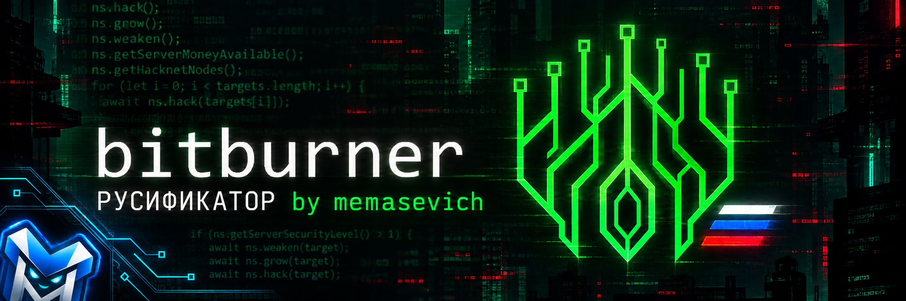
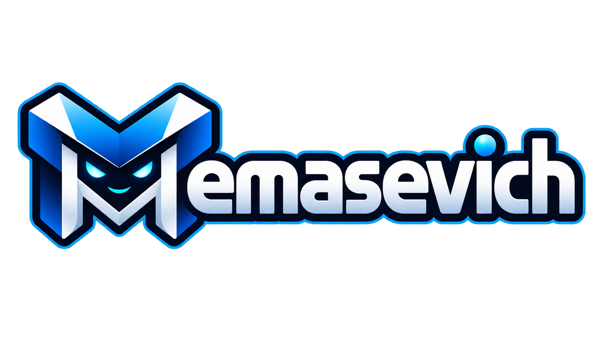

# Bitburner v3.0.1 — русификатор RU by memasevich

Русификатор Bitburner для игроков, которым хочется разобраться в игре и получать удовольствие от неё без постоянного перевода английского текста.

## Что это за проект

Bitburner — необычная игра про программирование, взлом, автоматизацию и развитие собственного персонажа. В игре много терминала, документации, подсказок, описаний механик и игровых событий.

Не каждый хорошо знает технический английский язык. Иногда игрок бросает игру не потому, что она ему не понравилась, а просто из-за языкового барьера. Этот русификатор создан для того, чтобы можно было спокойно освоиться в Bitburner, понять основные механики и постепенно погрузиться в игру.

Перевод создан **memasevich** и продолжает развиваться.

## Что уже переведено

Переведены основные пользовательские разделы игры:

- главное меню и навигация;
- терминал и подсказки по командам;
- редактор скриптов;
- документация и справочные страницы;
- обучение и игровые подсказки;
- персонаж и статистика;
- город и путешествия;
- фракции и компании;
- аугментации;
- Hacknet;
- корпорации;
- банды и клоны;
- фондовый рынок;
- Bladeburner;
- проникновения;
- достижения и вехи;
- параметры игры;
- контракты на программирование;
- меню сохранения, загрузки и экспорта игры.

Перевод постепенно дополняется. Если где-то остался английский текст, это можно сообщить автору — найденные места будут добавлены в следующие обновления.

## Как установить русификатор

1. Полностью закройте Bitburner.

2. Откройте репозиторий проекта:

   [GitHub — Bitburner_ru](https://github.com/memasevich/Bitburner_ru)

3. Нажмите зелёную кнопку **Code**, затем выберите **Download ZIP**.

4. Распакуйте скачанный архив.

5. Откройте папку с установленной игрой. Обычно она находится по адресу:

   `Steam\steamapps\common\Bitburner`

6. В папке игры откройте:

   `resources\app`

7. В архиве русификатора откройте папку:

   `resources\app`

8. Скопируйте содержимое этой папки в папку `resources\app` установленной игры.

9. Согласитесь на замену файлов.

10. Запустите Bitburner снова.

После успешной установки в заголовке окна появится отметка:

`Bitburner v3.0.1 — RU by memasevich`

Перед установкой рекомендуется сделать резервную копию папки игры.

## Что намеренно не переводится

Чтобы игра и пользовательские скрипты продолжали работать правильно, без перевода остаются:

- команды терминала;
- Netscript и API;
- имена серверов;
- названия файлов и программ;
- идентификаторы;
- фрагменты программного кода;
- значения, которые нужно вводить в скрипты.

Например, команды `ns.hack()`, `ns.grow()` и `ns.weaken()` должны оставаться в оригинальном виде.

## Как удалить русификатор

Если русификатор больше не нужен, есть два способа вернуть оригинальные файлы игры.

### Через Steam

1. Откройте библиотеку Steam.
2. Нажмите правой кнопкой мыши по Bitburner.
3. Выберите **Свойства**.
4. Откройте раздел **Установленные файлы**.
5. Нажмите **Проверить целостность файлов игры**.

Steam восстановит оригинальные файлы, а русификатор будет удалён.

### Вручную

Можно восстановить резервную копию файлов, сделанную перед установкой, или удалить изменённые файлы и снова выполнить проверку целостности через Steam.

## Нашли ошибку или непереведённый текст?

Напишите об ошибке в обсуждении проекта или создайте Issue на GitHub. Желательно указать:

- название страницы или раздела;
- исходный английский текст;
- где именно он встречается;
- скриншот, если это возможно.

Ссылка на проект:

[https://github.com/memasevich/Bitburner_ru](https://github.com/memasevich/Bitburner_ru)

## Об авторе

**memasevich** — независимый разработчик и автор русификаторов игр.

- GitHub: [github.com/memasevich](https://github.com/memasevich)
- Telegram: [@memasev1ch](https://t.me/memasev1ch)
- Boosty: [boosty.to/memasevich](https://boosty.to/memasevich)
- Поддержать разработку: [boosty.to/memasevich/donate](https://boosty.to/memasevich/donate)

## Благодарность

Если русификатор оказался полезен, можно поддержать проект обратной связью, сообщить об ошибках или поделиться ссылкой с другими игроками.

Спасибо всем, кто помогает находить непереведённые строки и делает Bitburner доступнее для русскоязычных игроков.

---

  

