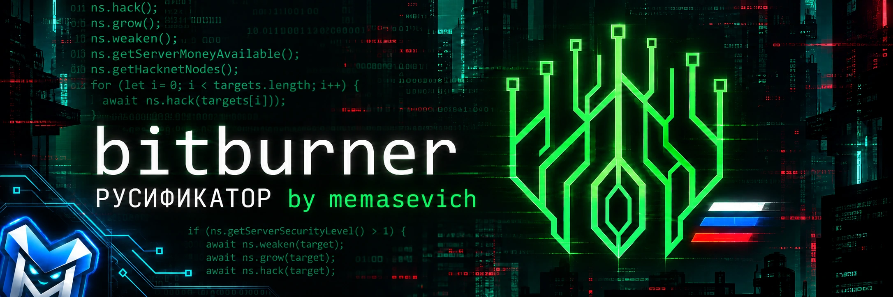
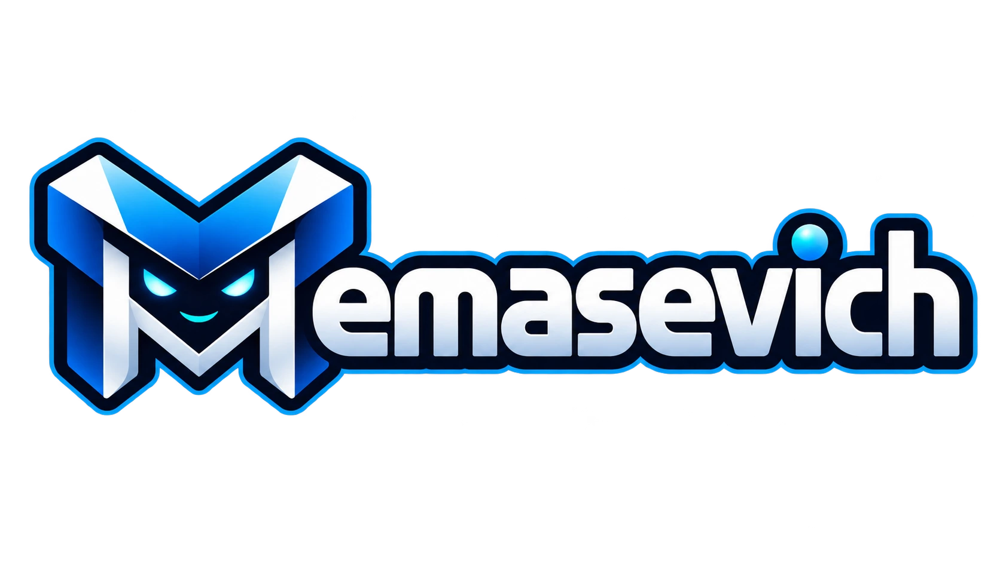

# Bitburner v3.0.1 — русификатор RU by memasevich

Русификатор Bitburner для игроков, которым хочется разобраться в игре и получать удовольствие от неё без постоянного перевода английского текста.

## О проекте / От автора

Я прекрасно понимаю, что в **Bitburner** чаще всего играют настоящие разработчики — люди, у которых технический английский находится где-то на уровне C6 и выше, а вызовы вроде `ns.hack()`, `ns.grow()` и `ns.weaken()` читаются как родная речь.

Но этот русификатор создавался не только для них.

Я давно хотел открыть дорогу в Bitburner тем, кому искренне интересны сама игра, программирование, логика и автоматизация, но для кого английский язык становится серьёзным барьером. Не все одинаково свободно читают техническую документацию, а в Bitburner её действительно колоссальный объём: интерфейс, глубокие механики, подсказки, фракции, контракты, системные события и документация API.

Очень обидно, когда человек бросает глубокую и увлекательную игру не из-за сложности задач, а просто потому, что устал переводить каждую строчку со словарём.

Поэтому я решил выпустить полноценный русификатор. Его цель — помочь спокойно разобраться в игре, понять её тонкости и получать удовольствие от погружения. При этом команды терминала, функции Netscript API, имена серверов и сам программный код намеренно оставлены без перевода: они должны оставаться оригинальными, чтобы ваши скрипты и примеры из сети продолжали исправно работать.

В Bitburner я наиграл очень много часов. Этот перевод я делал для себя ещё очень давно и долгое время даже не думал о релизе — как и в случае с целой пачкой других моих модификаций и русификаторов для различных игр. Только в 2026 году я наконец собрал наработки воедино и начал делиться ими с сообществом.

Не судите строго и не бросайтесь камнями, если перевод местами покажется шероховатым: проект переводился глубоко на уровне кода и веб-бандла игры, текста гигантский объём, и где-то формулировки ещё полируются. На мой взгляд, сейчас всё уже выглядит весьма достойно, а найденные опечатки будут оперативно исправляться!

## Что уже переведено

Переведены основные пользовательские разделы игры:

- главное меню и навигация;
- терминал и подсказки по командам;
- редактор скриптов;
- документация и справочные страницы;
- обучение и игровые подсказки;
- персонаж и статистика;
- город и путешествия;
- фракции и компании;
- аугментации;
- Hacknet;
- корпорации;
- банды и клоны;
- фондовый рынок;
- Bladeburner;
- проникновения;
- достижения и вехи;
- параметры игры;
- контракты на программирование;
- меню сохранения, загрузки и экспорта игры.

Перевод постепенно дополняется. Если где-то остался английский текст, это можно сообщить автору — найденные места будут добавлены в следующие обновления.

## Как установить русификатор

1. Полностью закройте Bitburner.

2. Откройте репозиторий проекта:

   [GitHub — Bitburner_ru](https://github.com/memasevich/Bitburner_ru)

3. Нажмите зелёную кнопку **Code**, затем выберите **Download ZIP**.

4. Распакуйте скачанный архив.

5. Откройте папку с установленной игрой. Обычно она находится по адресу:

   `Steam\steamapps\common\Bitburner`

6. В папке игры откройте:

   `resources\app`

7. В архиве русификатора откройте папку:

   `resources\app`

8. Скопируйте содержимое этой папки в папку `resources\app` установленной игры.

9. Согласитесь на замену файлов.

10. Запустите Bitburner снова.

После успешной установки в заголовке окна появится отметка:

`Bitburner v3.0.1 — RU by memasevich`

Перед установкой рекомендуется сделать резервную копию папки игры.

## Что намеренно не переводится

Чтобы игра и пользовательские скрипты продолжали работать правильно, без перевода остаются:

- команды терминала;
- Netscript и API;
- имена серверов;
- названия файлов и программ;
- идентификаторы;
- фрагменты программного кода;
- значения, которые нужно вводить в скрипты.

Например, команды `ns.hack()`, `ns.grow()` и `ns.weaken()` должны оставаться в оригинальном виде.

## Как удалить русификатор

Если русификатор больше не нужен, есть два способа вернуть оригинальные файлы игры.

### Через Steam

1. Откройте библиотеку Steam.
2. Нажмите правой кнопкой мыши по Bitburner.
3. Выберите **Свойства**.
4. Откройте раздел **Установленные файлы**.
5. Нажмите **Проверить целостность файлов игры**.

Steam восстановит оригинальные файлы, а русификатор будет удалён.

### Вручную

Можно восстановить резервную копию файлов, сделанную перед установкой, или удалить изменённые файлы и снова выполнить проверку целостности через Steam.

## Нашли ошибку или непереведённый текст?

Напишите об ошибке в обсуждении проекта или создайте Issue на GitHub. Желательно указать:

- название страницы или раздела;
- исходный английский текст;
- где именно он встречается;
- скриншот, если это возможно.

Ссылка на проект:

[https://github.com/memasevich/Bitburner_ru](https://github.com/memasevich/Bitburner_ru)

## Об авторе

Будем знакомы — **memasevich**! Независимый разработчик и автор русификаторов игр. Чтобы лучше понять, кто я такой и какие проекты делаю, вы можете просто загуглить «memasevich».

- GitHub: [github.com/memasevich](https://github.com/memasevich)
- Telegram: [@memasev1ch](https://t.me/memasev1ch)
- Boosty: [boosty.to/memasevich](https://boosty.to/memasevich)
- Поддержать разработку: [boosty.to/memasevich/donate](https://boosty.to/memasevich/donate)

## Благодарность

Если русификатор оказался полезен, можно поддержать проект обратной связью, сообщить об ошибках или поделиться ссылкой с другими игроками.

Спасибо всем, кто помогает находить непереведённые строки и делает Bitburner доступнее для русскоязычных игроков.

---

  

